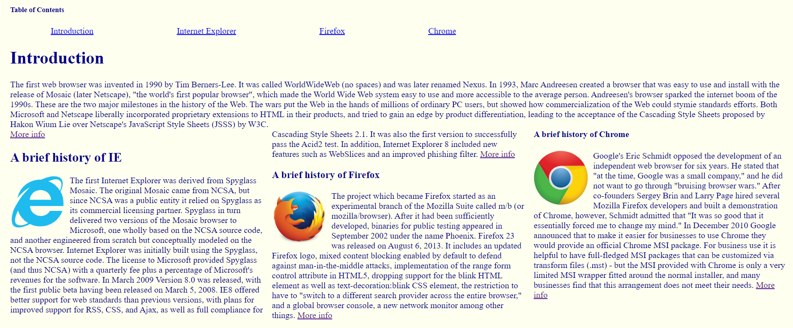

---
layout: essay
type: essay
title: "Importance of UI Frameworks"
# All dates must be YYYY-MM-DD format!
date: 2022-10-07
published: true
labels:
  - HTML
  - CSS
  - Bootstrap 5
---

<h2> Importance of UI Frameworks </h2>

Coming into this class with very rusty knowledge of HTML, I thought that these past few weeks of using HTML and CSS to create webpages was going to be tough, but I don’t think it was too bad for me. That was until we started using Bootstrap 5, and I got lost on what to do. I found it to be as difficult as learning a whole new language, while still having to brush up on my old knowledge of HTML, but by the end, I understood why UI Frameworks are useful. Knowing what I know now, I would say that using strictly HTML and CSS would be extremely inefficient and leave better tools left on the table. One example that comes to mind is the BrowserHistory3 assignment where I would constantly go back and increment the positions to get the proper padding or spacing between columns or links. With Bootstrap 5, I can get more work done out of the time that I put into my code. Creating things such as a navbar, button, or collapsable menu with icons can be done in a couple minutes rather than manually writing each component by hand for hours. 

<h2> Why using UI Frameworks is important </h2>

With this knowledge, I can also understand why this is standard business practice as, not only does it save time and money, but that effort can also be put towards other things such as readability and accessibility. As I now know from our WODs and assignments, making a pretty, readable website can be take a lot of time if done manually. From a business perspective, an ugly website can be detrimental to users as it could be offputting or lead it to be unaccesible to certain types of disabilities such as those with visual impairments. UI Frameworks can help with this as they can make a website look more clean and professional faster, which allows for more accessibility. 
